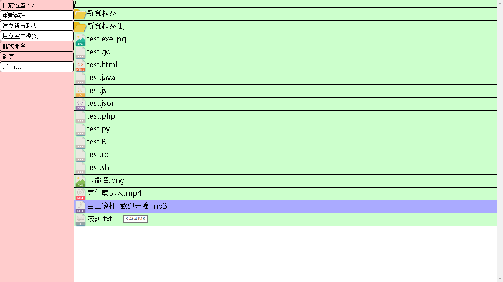
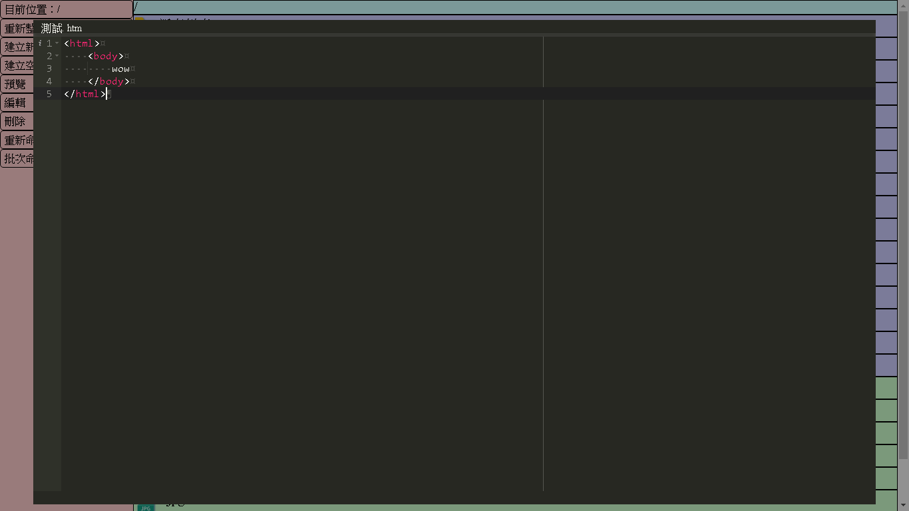

# [:octocat:TcStorage](https://github.com/TCCinTaiwan/TcStorage)

## Contents[↶](#)
* **[Introduction](#introduction)**
* **[History](#history)**

## Introduction[↶](#)
這是以寫[:octocat:舊版](https://github.com/TCCinTaiwan/file-manager)的經驗為基礎，重構的新版本。

## History[↶](#)
* 2017-01-25
    - 整理網頁，簡單重寫檔案管理
* 2017-01-26
    - 增加raw讀檔，並用.htaccess在網址中加入檔名
* 2017-01-27
    - 加入Ace
* 2017-01-28
    - raw合併下載
    - Ace加入標籤
* 2017-01-29
    - 命名為TcStorage
    - Ace改為多檔讀取
    - 改善IE 11相容性問題:xhr.response json vs object,函數預設值
* 2017-01-30
    - Ace開啟檔案編輯
    - 右鍵選單顯示並設定位置
    - 加入上傳檔案功能
    - 上傳Github
    - 調整上傳限制
    - Ace中文字型
    - 音樂影片開啟(含application/octet-stream)
