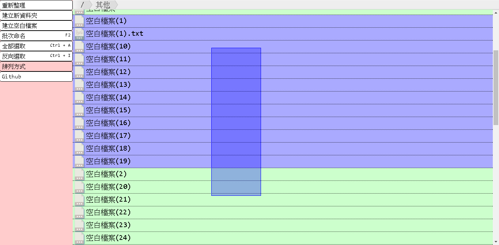
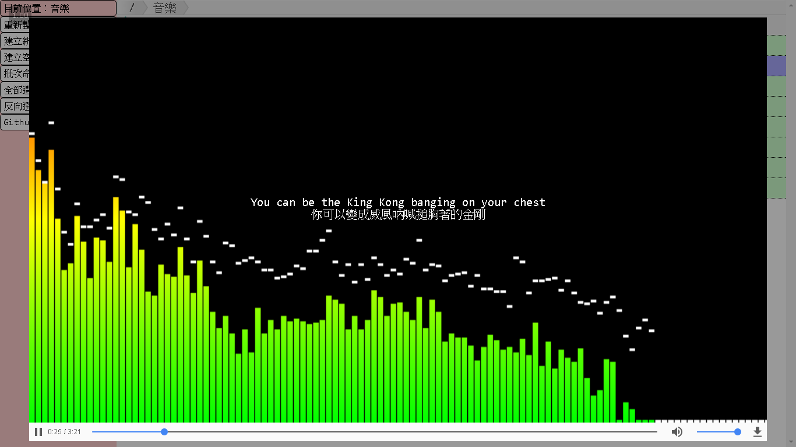
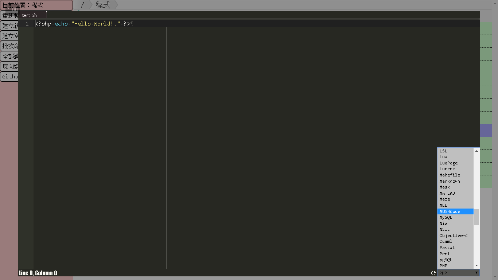

# [:octocat:TcStorage](https://github.com/TCCinTaiwan/TcStorage)
[](https://github.com/TCCinTaiwan/TcStorage/releases) [](https://gitter.im/TCCinTaiwan/TcStorage?utm_source=badge&utm_medium=badge&utm_campaign=pr-badge) [](https://travis-ci.org/TCCinTaiwan/TcStorage)

## Contents[↶](#)
* **[Introduction](#introduction)**
* **[Installation](#installation)**
* **[ShortKey](#shortkey)**
* **[Todo](#todo)**
* **[History](#history)**
* **[Contributing](#contributing)**

## Introduction[↶](#)
* Structure: PHP + MySQL + HTML5 + CSS3 + JS

這是以寫[:octocat:舊版](https://github.com/TCCinTaiwan/file-manager)的經驗為基礎，重構的新版本，多媒體參考[:octocat:TcTube](https://github.com/TCCinTaiwan/TcTube)部分內容，目前主要是在Chrome環境中執行，其他瀏覽器不一定支援。





## Installation[↶](#)
1. Clone the repository.
    * Use Command:
    ```bash
    cd C:/www/
    git clone https://github.com/TCCinTaiwan/TcStorage
    ```
    * Download Github zip:
        1. [ ](https://github.com/TCCinTaiwan/TcStorage/archive/master.zip)
        2. upzip to your web server's document root.

2. Running install page or step by step.
    * Install Page
    >The URL should like: http://localhost/TcStorage/install/index.php
    * Step by Step
        1. Create folders name "file/" and "logs/" .
        2. Import [TcStorage.sql](install/TcStorage.sql) at MySQL and change database name.
        3. Modify [connect.example.inc](install/connect.example.inc) to set the correct database connection information
        >Make sure the user has permission to view and modify the database

3. Ok, now you can open the browser using this system.
>The URL should like: http://localhost/TcStorage/index.php

## ShortKey[↶](#)
* <kbd>F2</kbd> 重新命名
* <kbd>Ctrl</kbd> + <kbd>A</kbd> 全選
* <kbd>Ctrl</kbd> + <kbd>I</kbd> 反選
* Ace Editor
    - <kbd>Ctrl</kbd> + <kbd>S</kbd> 儲存
    - <kbd>Esc</kbd> 顯示設定選單
    - <kbd>Ctrl</kbd> <kbd>Alt</kbd> <kbd>H</kbd> 列出快捷鍵
* Video/Audio

## Todo[↶](#)
* 多選 - shift
* 資料夾大小
* 檔案資訊
* 排列方式
* 帳戶
    - 分享網址
    - 權限
* 多語言
* 預覽
* 覆蓋選項
    - MD5檢查
* 使用提示

## History[↶](#)
Latest version is 0.1.2 , for detailed changelog, check [CHANGELOG.md](CHANGELOG.md).

## Contributing[↶](#)
1. Create an issue and describe your idea
2. [](https://github.com/TCCinTaiwan/TcTube/network) it!
3. Create your feature branch: `git checkout -b my-new-feature`
4. Commit your changes: `git commit -m 'Add some feature'`
5. Push to the branch: `git push origin my-new-feature`
6. Submit a Pull Request
